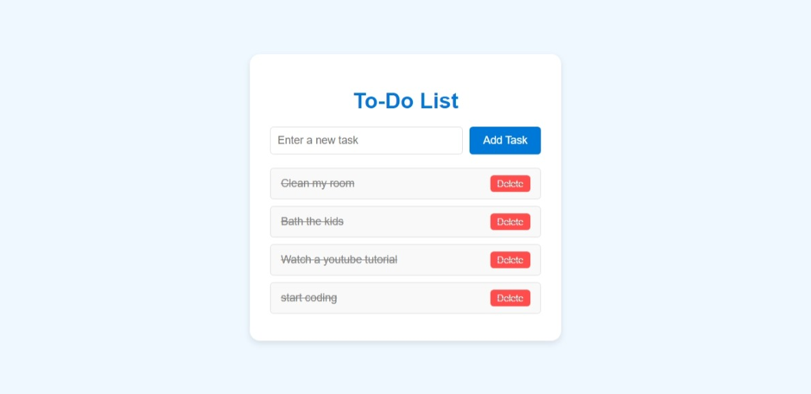

https://deepwiki.com/NickiMash17/To-Do-List

# 📝 Modern To-Do List

A clean, responsive task management application built with vanilla JavaScript.

## ✨ Features

- **Simple & Intuitive UI**: Clean design focused on usability
- **Task Management**: Add, complete, and delete tasks with ease
- **Responsive Design**: Works seamlessly on desktop and mobile devices
- **Local Storage**: Coming soon - save your tasks between sessions

## 🚀 Technologies Used

- HTML5
- CSS3
- JavaScript (Vanilla)

## 🔧 How It Works

The application allows users to:
1. Enter task text in the input field
2. Add tasks by clicking the "Add Task" button or pressing Enter
3. Mark tasks as complete by clicking on them
4. Remove tasks by clicking the delete button

## 💻 Code Structure

The project consists of three main files:

### HTML (index.html)
Contains the structure of the application including the task input field, button, and list container.

### CSS (style.css)
Provides styling for a modern, clean interface with:
- Soft color palette with blue accents
- Responsive layout adjustments
- Interactive hover effects
- Visual feedback for completed tasks

### JavaScript (script.js)
Handles all the functionality:
- Task creation and validation
- Task completion toggling
- Task deletion
- Event handling for both mouse and keyboard interactions

## 🌱 Future Enhancements

- Task persistence using local storage
- Task categories and filtering
- Due dates and reminders
- Dark mode toggle
- Drag and drop for task reordering

## 📄 License

MIT License

## 👩‍💻 Author

Coded with ❤️ by Nicolette Mashaba

---

Feel free to fork, modify, and use this project for personal or educational purposes!

